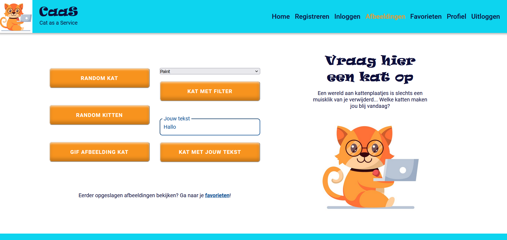

# CaaS - Cat as a Service

## 1. Inleiding

Als je van katten houdt, kan het aaien van zo'n pluizige viervoeter ontspannend en stressverlagend werken. Instant stress-relief op pootjes! Maar ja, op het werk, op school, in de trein etc. heb je meestal geen kat bij de hand. Gelukkig is uit onderzoek gebleken dat het kijken naar kattenfilmpjes of -plaatjes ook werkt. CaaS biedt de gebruiker een wereld aan leuke, gezellige en schattige afbeeldingen van katten. Precies voor die momenten waarop je wel even wat harige afleiding en ontspanning kunt gebruiken, maar er geen echte kat in de buurt is!

Deze webapplicatie is gemaakt als integrale eindopdracht voor de leerlijn Frontend van de NOVI Hogeschool te Utrecht.



Om gebruik te kunnen maken van alle functionaliteiten van de app, dient een gebruiker zich te registreren en vervolgens in te loggen.

## Belangrijkste functionaliteiten

- De gebruiker kan zich registreren en inloggen.
- De gebruiker kan een random kattenplaatje of GIF opvragen, indien gewenst met een bepaalde tag of filter, of een afbeelding met een tekstje naar keuze.
- De gebruiker kan zijn favoriete afbeeldingen opslaan en bewaren in zijn account.
- De gebruiker kan een profielfoto uploaden en indien gewenst zijn gegevens wijzigen.

## 2. Benodigdheden

Allereerst is een IDE nodig, zoals WebStorm, om de broncode te kunnen bekijken en de applicatie lokaal te laten draaien. De instructies verderop zijn geënt op WebStorm, maar bij een andere IDE zal dit op een vergelijkbare manier gaan.

Voor het gebruiken en managen van dependencies is Node Package Manager (NPM) nodig. Hiervoor is het nodig dat Node.js wordt geïnstalleerd, waarbij ook NPM zit. De downloadlink is [hier](https://nodejs.org/en/download) te vinden. Type na installatie in de terminal van de IDE het commando node -v en vervolgens npm -v. Indien er een versienummer verschijnt, zijn Node.js en NPM correct geïnstalleerd.

Voor het registreren en ophalen van gebruikersgegevens wordt gebruikt gemaakt van de NOVI Educational Backend. Documentatie en link naar de server is [hier](https://github.com/hogeschoolnovi/novi-educational-backend-documentation) te vinden.

De kern van deze webapplicatie wordt gevormd door een REST API genaamd CATAAS (Cat as a Service). Meer informatie en documentatie over deze API vind je [hier](https://cataas.com/#/). De API geeft de opgevraagde afbeeldingen op grond van verschillende endpoints. Er is geen API key nodig.

## 3. Project opstarten

1. Download of clone de repository met de broncode van GitHub [hier](https://github.com/MarjetBosma/NOVI-frontend-eindopdracht-CaaS).
    
   a. Download: Ga op GitHub naar Code (groene knop) en kies voor Download ZIP. Pak het zip-bestand uit op je eigen apparaat, en open het in WebStorm via File, Open.

   b. Clone: Ga op GitHub naar Code (groene knop) en kies voor Clone en SSH. Kopieer de SSH key. Open WebStorm, ga naar File, New, Project from Version Control. Er verschijnt een pop-up venster. Plak de SHH-key in het veld URL en open het project.


2. WebStorm zal nu vragen om de dependencies te installeren, klik op Yes. Of open de terminal en geef zelf het commando: 

    ```shell
    npm install
    ```
 
  
3. Start vervolgens de applicatie met het volgende commando:

    ```shell
    npm start
    ```
    De applicatie zal nu openen in de browser.


4. Volg de stappen op de registratie- en inlogpagina's. Daarna kun je alle mogelijkheden van de app verkennen! Bij inloggen wordt er een autorisatietoken aangemaakt, waarmee de gebruiker een uur lang blijft ingelogd. NB: Aangemaakte gebruikersgegevens worden ongeveer een uur bewaard op de server waarop de NOVI backend draait.


5. Geniet van je dosis kattenliefde! :-)

## 4. Beperkingen

Het betreft hier een demo-versie. Gebruikersgegevens worden slechts een uur bewaard op de NOVI Backend. Favoriete afbeeldingen worden opgeslagen in de local storage van de browser i.p.v. een server, en zijn deze niet gekoppeld aan een account. De local storage wordt geleegd bij uitloggen.
Bij nadere implementatie is een echte backend en server nodig om gebruikersgegevens en de bijbehorende favoriete afbeeldingen langdurig samen te kunnen opslaan.  

## 5. Verantwoording afbeelding logo

De afbeelding van het CaaS logo is afkomstig van Freepik (zie [hier](https://www.freepik.com/free-vector/flat-design-creative-nerd-logo-template_20827096.htm#page=9&query=cat%20logo&position=23&from_view=search&track=ais)), waarbij ik zelf een andere tekst heb bedacht en opgemaakt.

## 6. Contact

Vragen of opmerkingen? Laat een comment achter in de repository op GitHub (zie [hier](https://github.com/MarjetBosma/NOVI-frontend-eindopdracht-CaaS)) of stuur mij een e-mail op marjet_bosma@hotmail.com.

© Marjet Bosma, Eindopdracht Frontend, NOVI Hogeschool